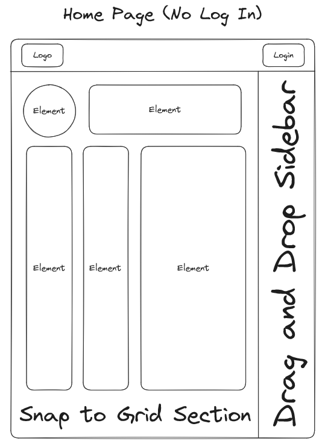
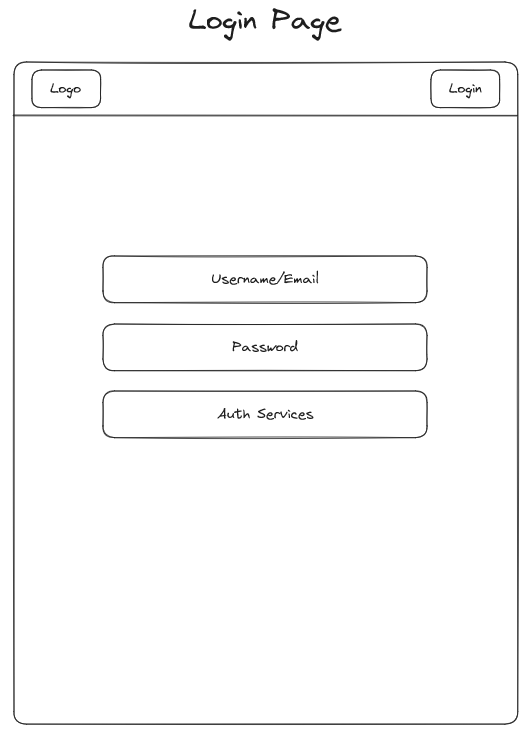
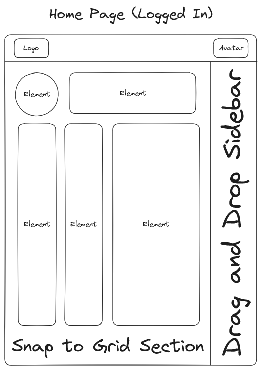
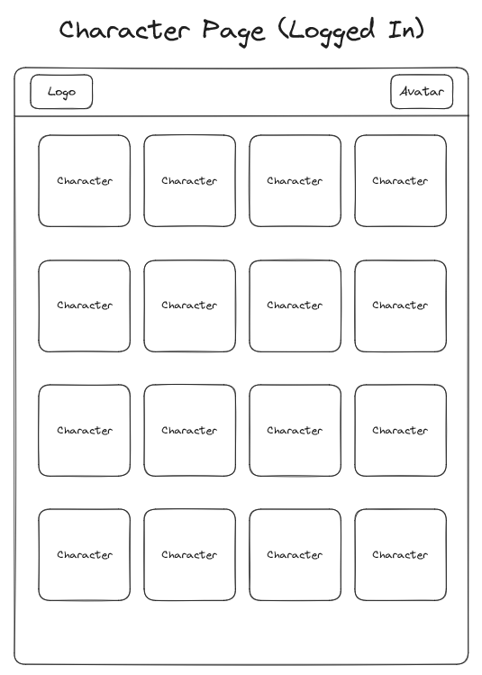
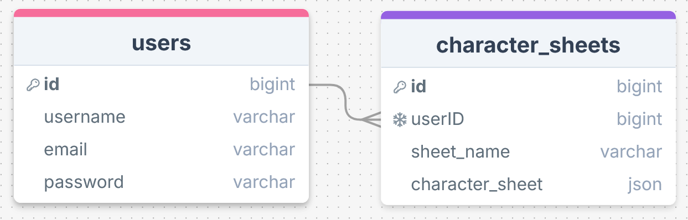

# Dragon Drop

## Overview

It's a place where Tabletop Roleplaying Game (TTRPG) players can customize their character sheet with a Drag and Drop interface.

### Problem Space

Most services are either locked behind a paywall for customization options or free but static and uninspired.

### User Profile

Players of any tabletop system looking to customize their character sheet their way

### Features

-   Drag and Drop components - Put what you want, where you want, however big you want
-   Snap to Grid - Keeping things nice and clean
-   Interactive elements - Add dice rolling, text, and images to each element

## Implementation

### Tech Stack

-   React
-   dndkit/react or react-draggable
-   Node
-   Express
-   MongoDB (for character sheet structure)
-   Mongoose.js (to use MongoDB in Express Server)
-   JWT/OAuth/SSO (for Authentication)

---

### APIs

-   None (so far, but maybe in the future)

---

### Sitemap

-   Home Page - The Editor (The aim is that it should be free)
-   Character Select Screen
-   Login Page

---

### Mockups

<details>
    <summary>HomePage - Not Logged In</summary>
    
</details>
<details>
    <summary>Login Page</summary>
    
</details>
<details>
    <summary>Home Page - Logged In</summary>
    
</details>
<details>
    <summary>Character Select</summary>
    
</details>

---

### Data



<details>
    <summary> character_sheets.character_sheet JSON structure </summary>

```json
[
    {
        "x": "int: x-coordinate of draggable element.",
        "y": "int: y-coordinate of draggable element.",
        "width": "int: width of draggable element.",
        "height": "int: height of draggable element.",
        "type": "varchar: type of the draggable element.",
        "name": "varchar: name of the draggable element",
        "text": "varchar: text typed into the draggable element",
        "diceNum": "int: number of dice to be rolled (if used)",
        "diceType": "int: type of dice to be rolled (if used)",
        "modifier": "int: value added to dice roll (if used)",
        "img_link": "varchar: link to the image (if used)"
    },
    {
        "x": "0",
        "y": "0",
        "width": "10",
        "height": "2",
        "type": "text",
        "name": "character name",
        "text": "Glorius Character Name"
    },
    {
        "x": "0",
        "y": "2",
        "width": "3",
        "height": "3",
        "type": "image",
        "name": "character portrait",
        "img_link": "http://www.link.to/awesome/character/image"
    },
    {
        "x": "3",
        "y": "2",
        "width": "1",
        "height": "3",
        "type": "dice",
        "name": "str",
        "text": "+4",
        "diceNum": "1",
        "diceType": "20",
        "modifier": "4",
        "img_link": "http://www.link.to/some/icon/for/strength"
    }
]
```

</details>

---

### Endpoints

<details>
    <summary>Sheets</summary>

`GET /api/v1/sheets`

-   Gets all sheet data

Response Body Exampe:

```json
[
    {
        "id": 0,
        "userID": 0,
        "sheet_name": "Character 1"
    },
    {
        "id": 1,
        "userID": 0,
        "sheet_name": "Character 2"
    },
    {
        "id": 2,
        "userID": 1,
        "sheet_name": "Hello World!"
    }
]
```

---

`POST /api/v1/sheets`

-   Create a new sheet

Request body example:

```json
{
    "userID": 2,
    "sheet_name": "",
    "character_sheet": [
        {
            "x": "0",
            "y": "0",
            "width": "10",
            "height": "2",
            "type": "text",
            "name": "character name",
            "text": "Glorius Character Name"
        },
        {
            "x": "0",
            "y": "2",
            "width": "3",
            "height": "3",
            "type": "image",
            "name": "character portrait",
            "img_link": "http://www.link.to/awesome/character/image"
        },
        {
            "x": "3",
            "y": "2",
            "width": "1",
            "height": "3",
            "type": "dice",
            "name": "str",
            "text": "+4",
            "diceNum": "1",
            "diceType": "20",
            "modifier": "4",
            "img_link": "http://www.link.to/some/icon/for/strength"
        }
    ]
}
```

Response Body Exampe:

```json
{
    "message": "Character sheet saved successfully.",
    "savedItem": {
        "id": 3,
        "userID": 2,
        "sheet_name": "test2's character",
        "character_sheet": [
            {
                "x": "0",
                "y": "0",
                "width": "10",
                "height": "2",
                "type": "text",
                "name": "character name",
                "text": "Glorius Character Name"
            },
            {
                "x": "0",
                "y": "2",
                "width": "3",
                "height": "3",
                "type": "image",
                "name": "character portrait",
                "img_link": "http://www.link.to/awesome/character/image"
            },
            {
                "x": "3",
                "y": "2",
                "width": "1",
                "height": "3",
                "type": "dice",
                "name": "str",
                "text": "+4",
                "diceNum": "1",
                "diceType": "20",
                "modifier": "4",
                "img_link": "http://www.link.to/some/icon/for/strength"
            }
        ]
    }
}
```

---

`GET /api/v1/sheets/:id`

-   Gets sheet data for a sheet id

Response Body Exampe:

```json
[
    {
        "x": "0",
        "y": "0",
        "width": "10",
        "height": "2",
        "type": "text",
        "name": "character name",
        "text": "Glorius Character Name"
    },
    {
        "x": "0",
        "y": "2",
        "width": "3",
        "height": "3",
        "type": "image",
        "name": "character portrait",
        "img_link": "http://www.link.to/awesome/character/image"
    },
    {
        "x": "3",
        "y": "2",
        "width": "1",
        "height": "3",
        "type": "dice",
        "name": "str",
        "text": "+4",
        "diceNum": "1",
        "diceType": "20",
        "modifier": "4",
        "img_link": "http://www.link.to/some/icon/for/strength"
    }
]
```

---

`PUT /api/v1/sheets/:id`

-   Update sheet data for a sheet id

Response Body Exampe:

```json
[
    {
        "x": "0",
        "y": "0",
        "width": "10",
        "height": "2",
        "type": "text",
        "name": "character name",
        "text": "Glorius Character Name"
    },
    {
        "x": "0",
        "y": "2",
        "width": "3",
        "height": "3",
        "type": "image",
        "name": "character portrait",
        "img_link": "http://www.link.to/awesome/character/image"
    },
    {
        "x": "3",
        "y": "2",
        "width": "1",
        "height": "3",
        "type": "dice",
        "name": "str",
        "text": "+4",
        "diceNum": "1",
        "diceType": "20",
        "modifier": "4",
        "img_link": "http://www.link.to/some/icon/for/strength"
    },
    {
        "x": "3",
        "y": "2",
        "width": "1",
        "height": "3",
        "type": "dice",
        "name": "con",
        "text": "+5",
        "diceNum": "1",
        "diceType": "20",
        "modifier": "5",
        "img_link": "http://www.link.to/some/icon/for/constitution"
    }
]
```

Response Body Exampe:

```json
{
    "message": "test2's character sheet saved successfully.",
    "savedItem": {
        [
            {
                "x": "0",
                "y": "0",
                "width": "10",
                "height": "2",
                "type": "text",
                "name": "character name",
                "text": "Glorius Character Name"
            },
            {
                "x": "0",
                "y": "2",
                "width": "3",
                "height": "3",
                "type": "image",
                "name": "character portrait",
                "img_link": "http://www.link.to/awesome/character/image"
            },
            {
                "x": "3",
                "y": "2",
                "width": "1",
                "height": "3",
                "type": "dice",
                "name": "str",
                "text": "+4",
                "diceNum": "1",
                "diceType": "20",
                "modifier": "4",
                "img_link": "http://www.link.to/some/icon/for/strength"
            },
            {
                "x": "3",
                "y": "2",
                "width": "1",
                "height": "3",
                "type": "dice",
                "name": "con",
                "text": "+5",
                "diceNum": "1",
                "diceType": "20",
                "modifier": "5",
                "img_link": "http://www.link.to/some/icon/for/constitution"
            }
        ]
    }
}
```

---

`DELETE /api/v1/sheets/:id`

-   Delete a sheet

Response Body Exampe:

```json
{
    "message": "test2 character sheet deleted successfully."
}
```

---

`GET /api/v1/sheets/user/:id`

-   Gets all sheet data for a particular user

Response Body Exampe:

```json
[
    {
        "id": 0,
        "userID": 0,
        "sheet_name": "Character 1"
    },
    {
        "id": 1,
        "userID": 0,
        "sheet_name": "Character 2"
    }
]
```

</details>

<details>
    <summary>Users</summary>

`POST /api/v1/user/`

-   Create a new user

Request body example:

```json
{
    "username": "test2",
    "email": "test2@example.com",
    "password": "securepassword"
}
```

Response Body Exampe:

```json
{
    "message": "User test2 created successfully.",
    "user": {
        "id": "2",
        "username": "test2",
        "email": "test2@example.com"
    }
}
```

---

`GET /api/v1/user/:id`

-   Gets info for a particular user

Response Body Exampe:

```json
{
    "id": 0,
    "username": "test1",
    "email": "test1@example.com"
}
```

---

`PUT /api/v1/user/:id`

-   Edit a user

Request body example:

```json
{
    "username": "test2",
    "email": "test2@change.com",
    "password": "securepassword"
}
```

Response Body Exampe:

```json
{
    "message": "User test2 edited successfully.",
    "user": {
        "id": "2",
        "username": "test2",
        "email": "test2@change.com"
    }
}
```

---

`DELETE /api/v1/user/:id`

-   Delete a user

Response Body Exampe:

```json
{
    "message": "User test2 deleted successfully."
}
```

---

`POST /api/users/login`

- Authenticate a user and return a token

Request body example:
```json
{
  "email": "test2@example.com",
  "password": "securepassword"
}
```

Response body example:
```json
{
  "message": "Login successful.",
  "token": "jwt-token-here",
  "user": {
    "id": "2",
    "username": "test2",
    "email": "test2@example.com"
  }
}
```

</details>

## Roadmap

### Phase 1: Testing and Selection
- Testing Phase
  - Experiment with MongoDB
  - Test react-draggable vs dnd-kit

### Phase 2: Front End with Hard-Coded Values
- Front End
  - Initialize repos
  - Create folder structure
  - Set up HTML and JSX structure with hard-coded values
  - Work on SASS
  - Order:
    - Home Page
    - Character Sheet Page

### Phase 3: Database Setup
- Database
  - Set up Database
  - Create collections

### Phase 4: API Creation
- Back End
  - Initialize repos
  - Create folder structure
  - Set up routes
  - Initialize migrations
  - Create seed-data
  - Initialize seed
  - Order:
    - Sheets
      - `GET`
      - `POST`
      - `DELETE`
      - `PUT`

### Phase 5: Integration
- Back End
  - Connect to Database
- Front End
  - Connect to API

### Phase 6: Capstone Showcase
- Test full product
- Demo MVP

---

## Future Implementations

- Front End
  - Login Page
- Back End:
  - Users
    - `GET`
    - `POST`
    - `DELETE`
    - `PUT`  
  - JWT/OAuth/SSO Integration 
- Deployment
  - Connect to Netlify
